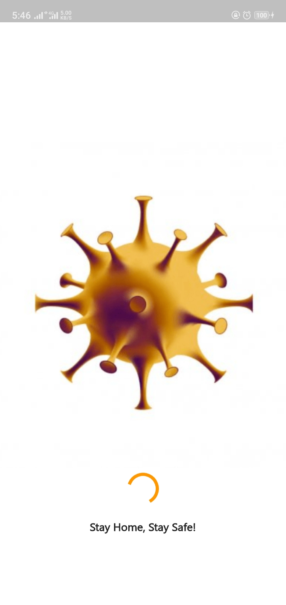
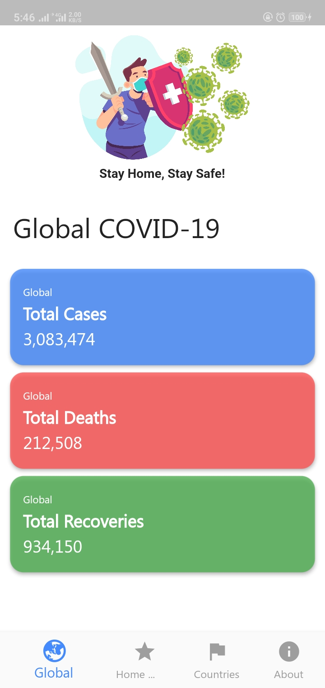
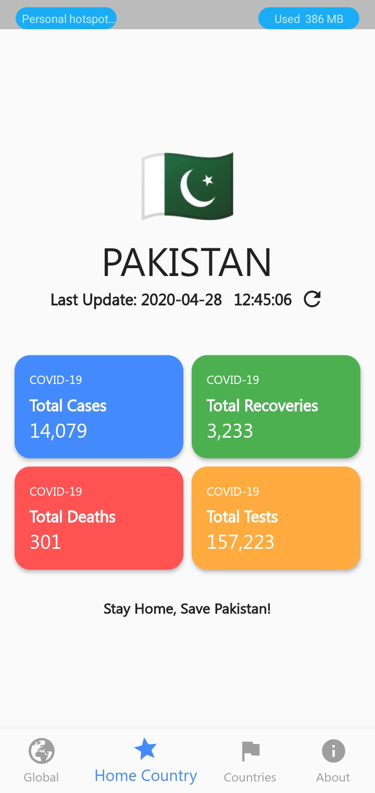
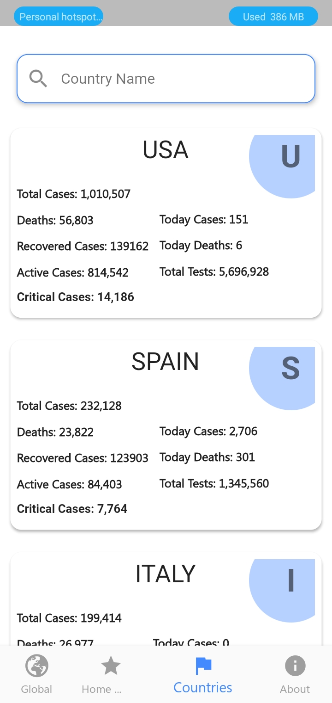

# COVID19 Tracker App

A simple COVID19 app that let's you see the stats across the Globe and my country Pakistan

It's a dedication to my Friend suffering from COVID

## Screen Shot

    

# Functionality
I've used APIs to fetch the data for Global and Country statistics this is not static data being displayed here

## APIs
For Global and Country Wise
https://github.com/javieraviles/covidAPI

For Pakistan
https://api.apify.com/v2/key-value-stores/QhfG8Kj6tVYMgud6R/records/LATEST?disableRedirect=true
